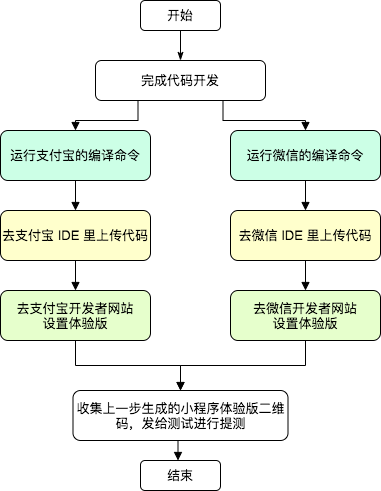
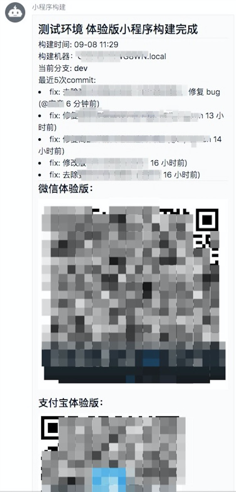

# taro-deploy 是什么？

如果你使用 [Taro](https://taro.aotu.io/) 开发小程序项目，可以使用本项目提供的命令行工具，进行一键自动化构建发布，并将构建结果推送到钉钉群里。

# 为什么要用 taro-deploy？

Taro 小程序开发者常有这种痛点：开发好代码想要发布提测，需要进行以下一系列步骤（以支付宝、微信小程序平台为例）：



整个流程将近十分钟，其中还有不少需要手动操作的环节，可以说这种原始的发布方式效率非常低。

taro-deploy 就是为了解决这个痛点出现的，它集成了支付宝和微信提供的命令行工具，自动化地完成上述流程。

用了 taro-deploy，开发者在发布提测时只需两步：

1. 运行一次命令 taro-deploy
2. 去喝杯茶歇一下

构建发布完了，钉钉上就会收到构建结果的推送了，全程无需人工干预。

以下为钉钉推送消息的截图。


可以看到除了发布生成的小程序二维码，推送消息里还附带了构建机器、构建分支、项目最近的 git commit 日志等，打包信息更清楚。

NOTE: git commit 日志目前只会展示 `feat` 和 `fix` 关键词开头的 commit

# 适合我用吗？

如果你

1. 使用 Taro 框架开发小程序
2. 需要支持微信和支付宝平台
3. 想要自动化构建发布，不想手动操作
4. 使用钉钉办公，开发和测试都在一个钉钉群里（这点不是必需的，没有钉钉也可以使用 taro-deploy，只是会多了一些手动操作）

那你就非常适合使用 taro-deploy 了。

# 怎么用？

## Step 1 - 安装

```shell
npm i -g taro-deploy
```

## Step 2 - 平台相关的准备步骤

1. 支付宝：参考[官方文档](https://opendocs.alipay.com/mini/alipaydev)，准备好私钥和 toolId。
2. 微信：参考[官方文档](https://developers.weixin.qq.com/miniprogram/dev/devtools/ci.html)，准备好私钥

## Step 3 - 创建钉钉机器人

参考[官方文档](https://ding-doc.dingtalk.com/doc#/serverapi2/qf2nxq)创建钉钉机器人，安全设置记得选择“自定义关键词”并填上“小程序构建”即可。

创建完成后，会得到一个形如 `https://oapi.dingtalk.com/robot/send?access_token=XXXXXX` 的 webhook url，后续会用到。

## Step 4 - 准备配置文件

在你的 Taro 项目根目录新建一个 deploy-config.js 文件，按下述模版填入内容。

这里需要配置的内容比较关键也比较多，成败在此一举了(」゜ロ゜)」

```js
// deploy-config.js
// 该文件应放在 Taro 项目的根目录下

module.exports = {
  // 构建结果的输出目录，该脚本产生的日志也会输出到这里
  outDir: './deploy-out',

  // 微信相关配置
  weapp: {
    // 如果为 false，则不会运行微信的构建流程
    enable: true,

    // Taro 编译后，微信程序包的输出路径
    projectPath: './dist/weapp',

    // Step 2 里获得的私钥文件的存放路径
    keyPath: './weapp.key',

    // 微信小程序 appId
    appId: 'wx82xxxxxx',

    // 微信体验版图片地址
    // 与支付宝不同，不管上传多少个新版本，微信的体验版地址是一直不变的
    // 因此需要在这里配置该二维码图片的链接
    // 直接从微信公众平台上复制的体验版图片地址貌似无法在钉钉里正常展示
    // 建议转存到自己的 CDN 上，再将 cdn url 填到下面这里来
    qrcodeImageUrl: 'https://xxxcdn.con/image/weapp-exp-qrcode.jpg',

    // 小程序版本号
    // 由于微信的命令行 sdk 不支持设置某个版本为体验版，要改设体验版需要在网页上手动操作
    // 所以只能曲线救国，先在网页上将本工具上传的版本设为体验版（找到 ci机器人1 上传的那个版本）
    // 然后每次上传都指定同一个版本号，以覆盖旧的版本，最终实现发布新体验版的效果
    version: '1.1.0',

    // true 则将跳过编译阶段，即 taro build 命令，
    skipBuild: false,
  },

  // 支付宝相关配置
  alipay: {
    // 如果为 false，则不会运行支付宝的构建流程
    enable: true,

    // Taro 编译后，支付宝程序包的输出路径
    projectPath: './dist/alipay',

    // Step 2 里获得的私钥文件的存放路径
    keyPath: './alipay.key',

    // Step 2 里获得的 toolId
    toolId: 'f48xxx',

    // 支付宝小程序 appId
    appId: '202xxx',

    // true 则将跳过 taro build 命令，即编译阶段
    skipBuild: false,
  },

  // 默认发体验版，填 false 则发布为预览版
  // 注意如果发布为预览版，需要实现 uploadImage 的函数，否则钉钉无法展示预览版的二维码
  isExperience: true,

  // 是否在构建前运行 npm install
  npmInstall: false,

  // 指定环境变量，会在编译阶段，即 taro build 的指令中注入指定的环境变量
  env: {
    BUILD_ENV: 'test' // 仅作 demo，实际应填入你项目编译需要用的环境变量
  },

  // Step 3 中获取的钉钉机器人 webhook url
  dingTalkUrl: 'https://oapi.dingtalk.com/robot/send?access_token=xxx',

  // 如果你只需要构建发布体验版小程序，则可忽略以下函数
  // 如果你需要构建发布预览版小程序，则需要实现该函数，将本地二维码图片文件转换为图片链接，否则无法将预览版二维码推送到钉钉群里
  // 其中 objectName 形如 {platform}-{timestamp}.jpg，作为建议保存的文件名
  // filePath 为本地预览版二维码图片的地址
  uploadImage: async function(objectName, filePath) {
    return ''
    // 如果你使用阿里云 oss 作 cdn，可以参考以下代码进行上传
    // const OSS = require('ali-oss')
    // const client = new OSS({
    //   region: 'oss-cn-xxx',
    //   accessKeyId: 'xxx',
    //   accessKeySecret: 'xxx',
    //   bucket: 'xxx',
    // })
    // await client.put(`preview/${objectName}`, filePath, {
    //   'Cache-Control': 'max-age=31536000'
    // })
    // return `https://xxx-oss-cdn.com/preview/${objectName}`
  }
}

```

## Step 5

```bash
# cd 到你们的项目并运行
taro-deploy
```

然后就可以静候钉钉机器人推送构建结果了 :-)

# FAQ

### Q: 我们没有用钉钉办公，怎么用 taro-deploy？
A: taro-deploy 目前只支持推送钉钉消息，否则只能完成自动化构建、上传、设置体验版，没法完成最后的推送步骤。如果有推送其它IM工具的需求，可以尝试自行实现，也欢迎提交 PR。

### Q: 为什么发布预览版要实现 uploadImage 函数这么麻烦？

A: 因为支付宝和微信的预览版只会生成本地的二维码图片，要想在钉钉消息里展示本地的二维码图片，只能先将图片上传到 cdn，再将 cdn 链接填进钉钉消息模版里。

### Q: 为什么发布以后，微信体验版还是旧的？

A: 请到微信的网页控制台上检查确保已将「ci机器人1」上传的版本设置为体验版。

### Q: 只支持微信和支付宝吗？

A: Taro 支持很多平台，但是 taro-deploy 目前只支持了微信和支付宝两个平台的自动构建和发布。

### Q: 没有找到 ci机器人1 上传的版本？

A: 先跑一遍 taro-deploy，等上传完成以后，就可以在微信小程序控制台网页的「版本控制」菜单里找到。

### Q: 这个工具有问题可能会造成小程序的线上故障吗？

A: taro-deploy 目前只支持发布预览版和体验版，不支持发布生产版，不会影响到生产环境。

### Q: 我想定制钉钉推送消息的模版

A: 目前没有开放很灵活的钉钉消息模版配置，如有需要可以 fork 本项目并定制修改 send-ding.js 文件，也欢迎提交 PR。